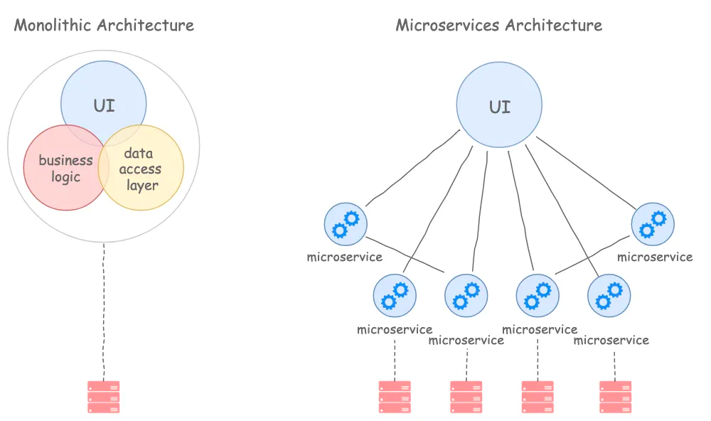

# Проблемы архитектуры системы для контроля полетов ERAM (En Route Automation Modernization): Монолитная архитектура, зависимость от сторонних сервисов и ограничения в расширении системы

В современном мире авиации важность надёжных систем управления воздушным движением не может быть переоценена. Они обеспечивают безопасность, эффективность и плавность воздушного трафика, что критически важно в условиях постоянно растущего объёма авиаперевозок. Одной из ключевых систем в этой сфере является ERAM (En Route Automation Modernization) – система, задуманная для модернизации и оптимизации процесса управления воздушным движением на протяжении маршрутов. Однако, несмотря на её передовые технологии и значительные инвестиции, ERAM сталкивается с рядом архитектурных и операционных проблем, которые ограничивают её эффективность и потенциал.

Эта статья представляет детальный анализ основных проблем системы ERAM, включая её монолитную архитектуру, зависимость от сторонних сервисов и ограничения в расширении системы. Рассмотрение этих аспектов критически важно для понимания того, как эти проблемы влияют на общую работоспособность системы, а также для выявления потенциальных путей её улучшения и модернизации. В конечном счёте, цель статьи – предоставить всесторонний взгляд на сложности, с которыми сталкивается система ERAM, и предложить рекомендации для её дальнейшего развития.

## Монолитная архитектура
Система ERAM (En Route Automation Modernization) имеет монолитную архитектуру, что влечет за собой ряд серьезных ограничений и проблем. Монолитная архитектура предполагает, что все компоненты системы, от обработки данных до пользовательского интерфейса, тесно интегрированы и функционируют как единое целое. Хотя такая структура может обеспечить надежную связь между компонентами и упрощенное управление, она также приводит к ряду серьезных недостатков, особенно в контексте сложной и динамичной среды управления воздушным движением.

Одной из основных проблем монолитной архитектуры является трудность внесения изменений и обновлений. Любые модификации, будь то исправления ошибок, обновления функций или интеграция новых технологий, требуют вмешательства в всю систему. Это не только увеличивает риск внесения новых ошибок и проблем, но и значительно усложняет процесс обновления. В среде, где технологии развиваются быстро, такая негибкость может серьезно ограничить способность системы адаптироваться к новым требованиям и улучшениям.

Кроме того, монолитная архитектура увеличивает риск системных сбоев. Ошибка в одном компоненте может привести к сбоям во всей системе, что особенно критично для системы, ответственной за безопасность и эффективность воздушного движения. Это также означает, что для обслуживания или обновления системы часто требуется время простоя, что может негативно сказаться на работе авиатранспортной сети.

Сложность монолитной архитектуры также отражается в высоких требованиях к поддержке и обслуживанию. Обновление системы требует значительных ресурсов, как временных, так и финансовых, а также высококвалифицированных специалистов. Это увеличивает общие затраты на эксплуатацию и поддержку системы.

В целом, монолитная архитектура системы ERAM ограничивает ее гибкость, масштабируемость и способность быстро адаптироваться к изменениям, что является серьезным недостатком в быстро меняющейся сфере управления воздушным движением.

### Пути решения:
- Переход к микросервисной архитектуре: Один из наиболее эффективных способов решения проблем монолитной архитектуры - это переход к микросервисной архитектуре. В микросервисной архитектуре каждый компонент системы функционирует как независимый сервис, что облегчает процесс внесения изменений, тестирования и обновления системы. Это также повышает устойчивость системы к ошибкам, поскольку сбой в одном микросервисе менее вероятно повлечёт за собой сбои в других частях системы.

- Модульное тестирование и автоматизация: Разработка строгой системы модульного тестирования и автоматизации тестирования позволит быстрее идентифицировать потенциальные проблемы в системе до их реализации в производственной среде.

- Инкрементное обновление: Вместо крупных, редких обновлений системы, следует перейти к инкрементной модели разработки. Это предполагает более частые, но меньшие по объёму обновления, что снижает риски и упрощает процесс интеграции новых функций и исправления ошибок.

## Зависимость от сторонних сервисов
Зависимость системы ERAM от сторонних сервисов является ещё одной значительной проблемой. Использование внешних сервисов и интеграций необходимо для обеспечения широкого спектра функциональностей, таких как данные о погоде, навигационная информация и другие критически важные аспекты управления воздушным движением. Однако эта зависимость вносит ряд рисков и ограничений.

Прежде всего, это увеличивает вероятность непредвиденных проблем из-за внешних факторов, которые находятся вне контроля ERAM. Если сторонний сервис сталкивается с техническими проблемами, задержками в обновлении данных или вопросами безопасности, это напрямую влияет на работоспособность системы ERAM. Такие ситуации могут привести к задержкам в полётах, ухудшению общей безопасности и повышению операционных рисков.

Сторонние сервисы также влияют на общую стабильность и производительность системы. Колебания в качестве сервиса или изменения в предоставляемых данных могут потребовать дополнительной настройки и адаптации со стороны ERAM, что увеличивает сложность управления системой и ресурсы, необходимые для ее поддержания.

Кроме того, существует проблема совместимости и интеграции. Обновления или изменения в сторонних сервисах могут потребовать существенной переработки соответствующих модулей ERAM, что требует времени и ресурсов. Это также может привести к временному снижению функциональности или производительности системы.

### Пути решения:
- Диверсификация поставщиков данных: Вместо зависимости от одного или нескольких крупных поставщиков, ERAM может использовать данные от большего числа источников. Это уменьшит риски, связанные с возможными сбоями или задержками отдельных поставщиков, распределяя нагрузку и уменьшая зависимость от одного источника.

- Создание запасных систем и механизмов отказоустойчивости: Разработка и внедрение систем, которые могут переключаться на альтернативные источники данных или временные решения в случае сбоя основных сторонних сервисов, повысит устойчивость системы к внешним воздействиям.

- Внутренние проверки и балансировка данных: Имплементация систем проверки и валидации данных от внешних источников может помочь минимизировать риски, связанные с неточной или устаревшей информацией. Это включает в себя алгоритмы для обнаружения аномалий и механизмы для балансировки разнородных данных.

- Интеграция с механизмами предварительной обработки данных: Применение механизмов предварительной обработки данных может снизить зависимость от точности и актуальности внешних данных, позволяя системе более эффективно реагировать на изменения.

- Регулярное обновление и тестирование системы на предмет совместимости: Регулярные обновления и тестирование системы на совместимость с различными источниками данных гарантируют, что ERAM остается гибкой и адаптируемой к изменениям в сторонних сервисах.

## Ограничения в расширении системы
Ограничения в расширении системы ERAM напрямую связаны с её монолитной архитектурой и зависимостью от внешних сервисов. Монолитная архитектура делает интеграцию новых функций, технологий или улучшений сложным и ресурсоемким процессом. Каждое расширение или изменение требует тщательной проверки всей системы, чтобы избежать конфликтов и сбоев в работе.

Также, учитывая быстрое развитие технологий в области управления воздушным движением, система ERAM сталкивается с проблемой устаревания. Быстрая интеграция нововведений, таких как улучшенные алгоритмы обработки данных или новые системы коммуникации, становится сложной задачей из-за ограничений монолитной архитектуры.

Кроме того, зависимость от внешних сервисов означает, что любое расширение или обновление должно учитывать не только внутреннюю архитектуру ERAM, но и внешние интерфейсы и протоколы. Это увеличивает сложность управления изменениями и может привести к дополнительным задержкам и увеличению стоимости.

В заключение, проблемы монолитной архитектуры, зависимости от сторонних сервисов и ограничений в расширении системы создают серьезные трудности для системы ERAM. Эти проблемы не только повышают операционные риски и затраты, но и ограничивают способность системы адаптироваться к новым требованиям и развитиям в сфере управления воздушным движением.
### Пути решения: 
- Постепенный переход к модульной архитектуре: Переход от монолитной к модульной архитектуре позволит системе быть более гибкой и адаптивной. В модульной архитектуре отдельные функции и задачи выделяются в независимые модули, что упрощает процесс их обновления и расширения без необходимости переработки всей системы.

- Разработка адаптивных интерфейсов для интеграции с внешними сервисами: Создание гибких и адаптивных интерфейсов, которые могут легко интегрироваться с различными внешними сервисами, уменьшит зависимость от конкретных поставщиков и упростит процесс внедрения новых технологий.

- Постоянное тестирование и оценка производительности: Регулярное тестирование системы на предмет производительности и совместимости с новыми технологиями и сервисами обеспечит своевременное выявление и устранение проблем, способствуя непрерывному улучшению системы.

- Инвестиции в обучение и развитие персонала: Обучение и развитие персонала, работающего с системой ERAM, обеспечит наличие необходимых навыков и знаний для эффективного управления изменениями и адаптации к новым технологиям.